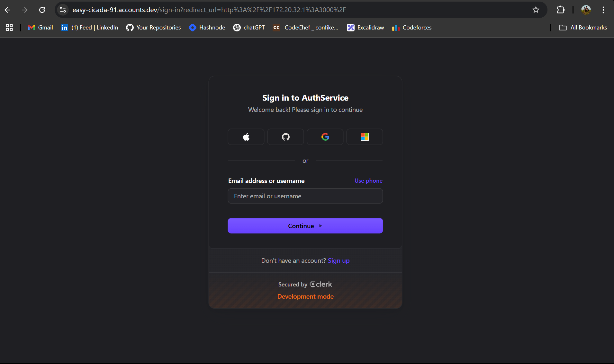
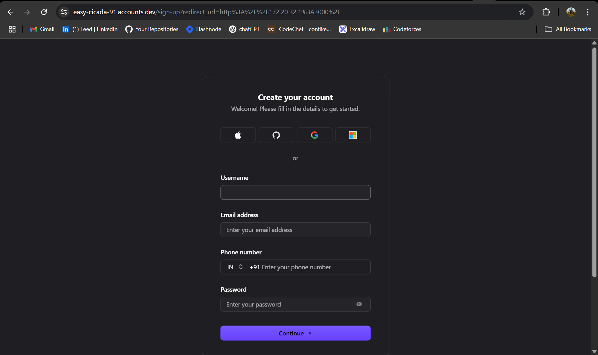
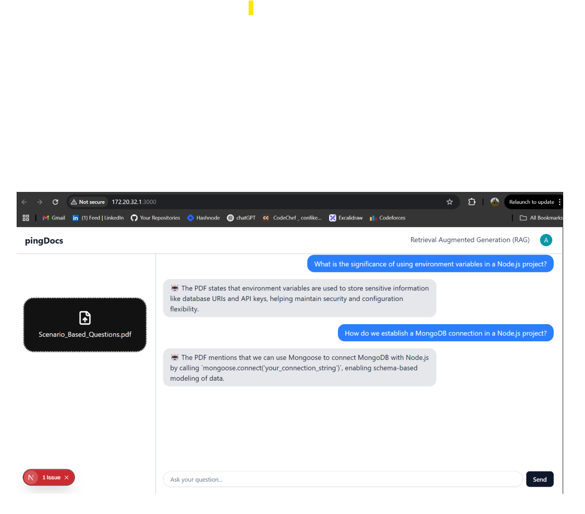

# RAG-Powered Q&A Web Application

A modern question-answering system built with Retrieval-Augmented Generation that leverages custom knowledge bases to provide intelligent responses.


## 🚀 Key Features

- **Intelligent Q&A System** powered by vector similarity search and OpenAI
- **Background Processing** via BullMQ for resource-intensive tasks 
- **High-Performance Caching** with Redis/Vallkey
- **Secure Authentication** through Clerk
- **Responsive UI** with chat-like interface and context retention

## 🛠️ Tech Stack

| Layer | Technologies |
|-------|-------------|
| **Frontend** | Next.js, React, TypeScript, Tailwind CSS, shadcn/ui |
| **Backend** | Node.js, Express |
| **Database** | Qdrant (vector database) |
| **Queue System** | BullMQ, Vallkey (Redis) |
| **AI/ML** | OpenAI, LangChain |
| **Auth** | Clerk |

## 🧠 System Architecture

The application follows a RAG (Retrieval-Augmented Generation) architecture:

1. **Document Processing** → Extract text from PDFs
2. **Chunking** → Split content into manageable sections 
3. **Embedding** → Generate vector representations via OpenAI
4. **Vector Storage** → Index chunks in Qdrant for fast retrieval
5. **Query Processing** → Match questions to relevant document chunks
6. **Response Generation** → Produce natural language answers with context

## 📸 Project Showcase

<div align="center">
  
  <p><em>User's Auth Signin Page</em></p>
  
  <br/>

  <p><em> Sign up Page</em></p>
  
  <br/>
  
  
  <p><em>Main Q&A Interface - Users can ask questions about uploaded documents</em></p>
   
</div>

## 🔍 System Architecture

<div align="center">
  
</div>

## 💻 Code Examples

### PDF Processing

```typescript
import { PDFLoader } from "@langchain/community/document_loaders/fs/pdf";

const loader = new PDFLoader(job.data.path);
const docs = await loader.load();
```

### Text Chunking

```typescript
import { CharacterTextSplitter } from "langchain/text_splitter";

const splitter = new CharacterTextSplitter({
   chunkSize: 300,
   chunkOverlap: 1,
});

const splitDocs = await splitter.splitDocuments(docs);
```

### Vector Embedding

```typescript
import { OpenAIEmbeddings } from '@langchain/openai';

const embedding = new OpenAIEmbeddings({
    model: 'text-embedding-3-small',
    apiKey: 'your_api_key'
});
```

### Qdrant Storage

```typescript
import { QdrantVectorStore } from '@langchain/qdrant';

const vectorStore = await QdrantVectorStore.fromExistingCollection(
   embedding,
   {
      url: 'redis_connection_URL',
      collectionName: 'pdf-docs'
   }
);
await vectorStore.addDocuments(docs);
```

## 🚀 Getting Started

### Installation

```bash
# Clone repository
git clone [repository-url]

# Install dependencies
npm install
```

### Running the Application

```bash
# Start frontend (from client directory)
cd client
npm run dev

# Start backend (in a new terminal)
cd server
npm run start

# Start worker (in a new terminal)
npm run start:worker
```

## 📝 Contributing

Contributions are welcome! Please feel free to submit a Pull Request.

## 📄 License

This project is licensed under the MIT License - see the LICENSE file for details.

## 👨‍💻 Author

Akash Maurya

---

*Built with ❤️ and advanced NLP/AI technologies*
